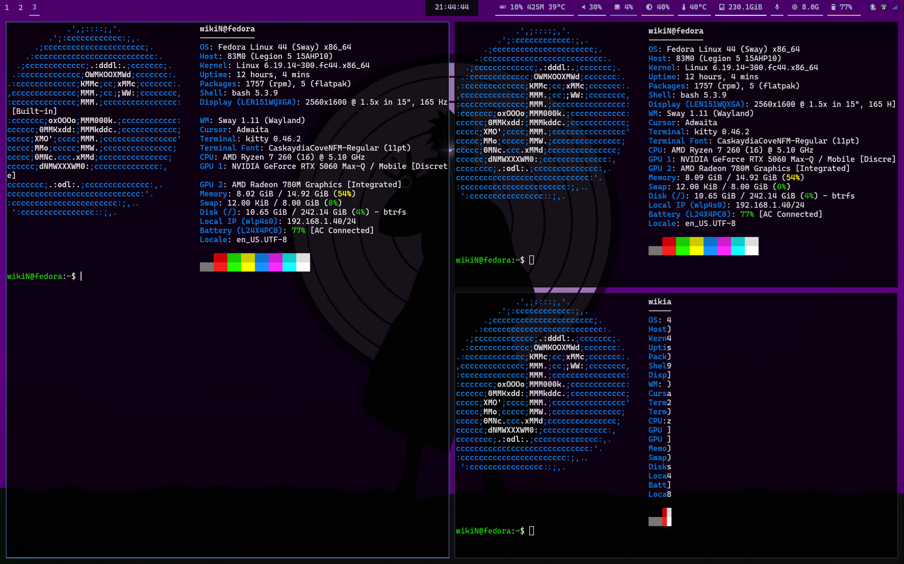

# dotfiles

Sway + Waybar setup on Fedora (Wayland). Includes legacy i3 + polybar config.




---

## Apps & Tools

### Core
| App | Purpose |
|-----|---------|
| `sway` | Wayland tiling window manager |
| `waybar` | Status bar |
| `swaylock` | Lock screen |
| `swayidle` | Idle management (auto-lock + display off) |
| `rofi` | App launcher, window switcher, power menu |
| `kitty` | Terminal emulator |

### Apps
| App | Purpose |
|-----|---------|
| `google-chrome` | Browser (Mod+c) |
| `code` | VS Code (Mod+p) |
| `thunar` | File manager (Mod+o) |

### Media & System
| App | Purpose |
|-----|---------|
| `wireplumber` / `wpctl` | Audio control (PipeWire) |
| `brightnessctl` | Brightness control |
| `swayosd` | On-screen display for volume/brightness/mic |
| `swaync` | Notification center daemon |

### Screenshot
| App | Purpose |
|-----|---------|
| `grim` | Wayland screen capture |
| `slurp` | Region selection |
| `swappy` | Screenshot annotation & save |

### Tray
| App | Purpose |
|-----|---------|
| `copyq` | Clipboard manager |
| `nm-applet` | WiFi tray icon |
| `blueman-applet` | Bluetooth tray icon |

### Fonts
- **CaskaydiaCove Nerd Font** — UI font (bar, borders, icons)
- Nepali TTF fonts in `fonts/` — optional, for Nepali language support

---

## Installation

### 1. Install dependencies

```bash
sudo dnf install sway waybar swaylock swayidle rofi kitty thunar \
  wireplumber brightnessctl grim slurp swappy \
  copyq network-manager-applet blueman \
  xdg-desktop-portal-wlr xdg-desktop-portal-gtk
```

Install swayosd (Wayland OSD for volume/brightness):
```bash
sudo dnf copr enable mochaa/swayosd
sudo dnf install swayosd
```

Install swaync (notification center):
```bash
sudo dnf install swaynotificationcenter
```

Install Google Chrome and VS Code via their official `.rpm` repos.

### 2. Clone the repo

```bash
git clone <repo-url> ~/Documents/self/dotfiles
```

### 3. Create config directories

```bash
mkdir -p ~/.config/sway/scripts
mkdir -p ~/.config/waybar/scripts
mkdir -p ~/.config/waybar/colors
```

### 4. Symlink sway configs

```bash
ln -s ~/Documents/self/dotfiles/sway/config                    ~/.config/sway/config
ln -s ~/Documents/self/dotfiles/sway/scripts/burn-in.sh        ~/.config/sway/scripts/burn-in.sh
ln -s ~/Documents/self/dotfiles/sway/scripts/powermenu.sh      ~/.config/sway/scripts/powermenu.sh
ln -s ~/Documents/self/dotfiles/sway/scripts/notify-osd.sh     ~/.config/sway/scripts/notify-osd.sh
ln -s ~/Documents/self/dotfiles/sway/scripts/waybar.sh         ~/.config/sway/scripts/waybar.sh
```

### 5. Symlink waybar configs

```bash
ln -s ~/Documents/self/dotfiles/waybar/config.jsonc                 ~/.config/waybar/config.jsonc
ln -s ~/Documents/self/dotfiles/waybar/style.css                    ~/.config/waybar/style.css
ln -s ~/Documents/self/dotfiles/waybar/colors/colors.dark.css       ~/.config/waybar/colors/colors.dark.css
ln -s ~/Documents/self/dotfiles/waybar/scripts/gpu.sh               ~/.config/waybar/scripts/gpu.sh
ln -s ~/Documents/self/dotfiles/waybar/scripts/mic-vol.sh           ~/.config/waybar/scripts/mic-vol.sh
```

### 6. Make scripts executable

```bash
chmod +x ~/Documents/self/dotfiles/sway/scripts/*.sh
chmod +x ~/Documents/self/dotfiles/waybar/scripts/*.sh
```

### 7. Install Nepali fonts (optional)

```bash
cp ~/Documents/self/dotfiles/fonts/*.TTF ~/.local/share/fonts/
cp ~/Documents/self/dotfiles/fonts/*.ttf ~/.local/share/fonts/
fc-cache -f
```

### 8. Fix wallpaper path

Edit `sway/config` and update to your username:
```
output * bg /home/<user>/Documents/self/dotfiles/wallpapers/purple.jpg fill
```

### 9. Disable dunst (if installed)

swaync handles all notifications. If dunst is running it will conflict:
```bash
pkill dunst
# Check it's not in autostart:
ls ~/.config/autostart/
```

### 10. Start sway

Log out and select **Sway** from your display manager, or run `sway` from a TTY.

---

## Keybindings

| Key | Action |
|-----|--------|
| `Mod+Return` | Terminal (kitty) |
| `Mod+d` | App launcher (rofi) |
| `Mod+Tab` | Window switcher (rofi) |
| `Mod+c` | Google Chrome |
| `Mod+p` | VS Code |
| `Mod+o` | File manager (Thunar) |
| `Mod+n` | Toggle notification center (swaync) |
| `Mod+Shift+s` | Screenshot — select region → annotate (grim+slurp+swappy) |
| `Mod+Shift+Delete` | Power menu (rofi) |
| `Mod+Shift+c` | Reload sway config |
| `Mod+Shift+q` | Close window |
| `Mod+Shift+e` | Exit sway (with confirmation) |
| `XF86AudioRaiseVolume` | Volume up 5% (swayosd) |
| `XF86AudioLowerVolume` | Volume down 5% (swayosd) |
| `XF86AudioMute` | Toggle mute (swayosd) |
| `XF86AudioMicMute` | Toggle mic mute (swayosd) |
| `XF86MonBrightnessUp` | Brightness up 5% (swayosd) |
| `XF86MonBrightnessDown` | Brightness down 5% (swayosd) |

### Power menu (`Mod+Shift+Delete`)
Lock · Shutdown · Reboot · Suspend · Hibernate · Exit Sway

---

## Features

### OLED Burn-in Prevention (`sway/scripts/burn-in.sh`)
Runs on every sway start/reload and randomizes:
- **Wallpaper** — picks randomly from `wallpapers/`
- **Waybar position** — top-left, top-right, bottom-left, bottom-right
- **Module order** — shuffles vitals modules each boot
- **Accent colors** — 12-color pool, all unique per module underline, cycles before repeating
- **Window border color** — matches the accent color

### Notifications
- **swayosd** — pill-style OSD overlay for volume/brightness/mic
- **swaync** — full notification daemon + panel (`Mod+n`)

### Idle & Lock
- Screen locks after **5 minutes** of inactivity (`swaylock` — black screen)
- Display powers off after **10 minutes**
- Locks before sleep

### Dark Mode
- GTK4, GTK3, and Qt apps all use dark theme via gsettings + `QT_QPA_PLATFORMTHEME=gtk3`

### Urgent Windows
- 3px bright red border box on urgent windows
- Blinking workspace indicator in waybar

---

## Display Scaling

Default scale is `1.5` for HiDPI. Adjust in `sway/config`:
```
output eDP-1 scale 1.5
```
